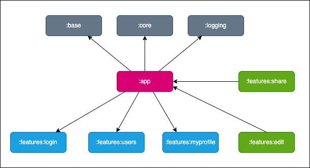
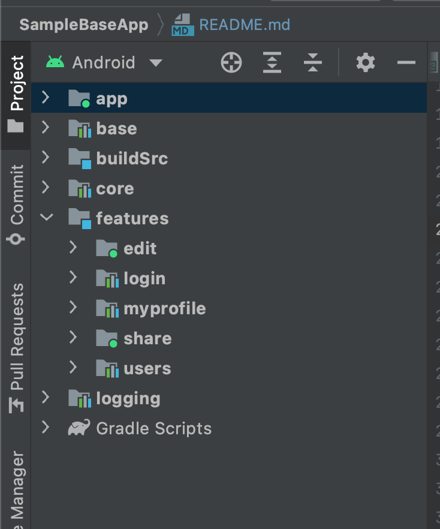

# SampleBaseApp
Android sample base application that uses clean architecture and modularization. With advantages of
this architectures make application is easy to read, understand , scale and maintains.

Introduction
--------------

This app is just a sample app using mock api, not real app, my goal is just to describe how I split modules and layers.

### Modules

There are different ways of dividing modules depending on the characteristics of each application. Here I use the module-by-feature division.
All of a feature's resources will be placed in a module whose name is the feature's name. 
There are also `common`, `core` and `logging` modules, which will be used by feature modules. 

With this division, the application will have separate features, making development and maintenance easier.
The dependencies of the modules are depicted in the diagram below.

Note: The `app` module can access all other modules except `edit` module, because the `edit` module
is a dynamic module, the dependency of the `edit` module and the `app` module is an inverse
dependency. Android Studio installs all your modules by default, including dynamic features. To test
the installation of dynamic feature modules you can
use [bundle tool](https://developer.android.com/studio/command-line/bundletool), a command-line
tool.

* `app` module: is an application module which contains MainApplication and MainActivity.
* `base` module: contains all base classes that can be used for other applications.
* `core` module: contains classes that are shared by modules. For example, create objects: Retrofit,
  Database, Preferences, ...
* `logging` module: contains custom logging methods. This app use Timber library.
* `login` module: is a feature module which is available when install app. It contains login and registration flow.
* `users` module: is a feature module and it is available when install app. This feature contains list users screen and detail user screen.
* `myprofile` module: is a feature module which is available when install app. This feature contains my profile screen.
* `edit` module: is a dynamic feature module which no available when install app. When user need it,
  it will be download. This feature contain edit user info screen.
* `share` module: is a instant dynamic feature module which available when run instant app.

### Packets in feature module

All feature modules will have the same type of package split.

### Data flow

Follow clean architecture at [here](https://blog.cleancoder.com/uncle-bob/2012/08/13/the-clean-architecture.html).

### Work flow

The app use MVVM pattern.

### References

* [CleanArchitecture][0] - Android Kotlin Clean Architecture
* [Real-World Android by Tutorials][1] - The projects and materials that accompany the Real-World Android by Tutorials book

[0]: https://github.com/bachhoan88/CleanArchitecture
[1]: https://github.com/raywenderlich/adva-materials
